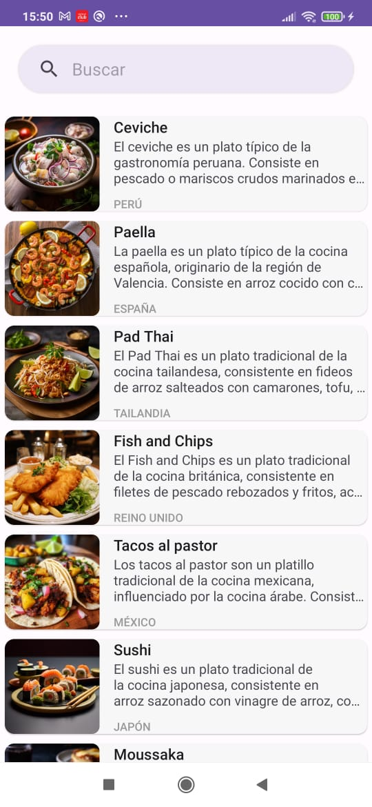
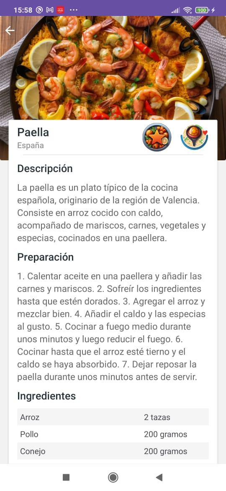
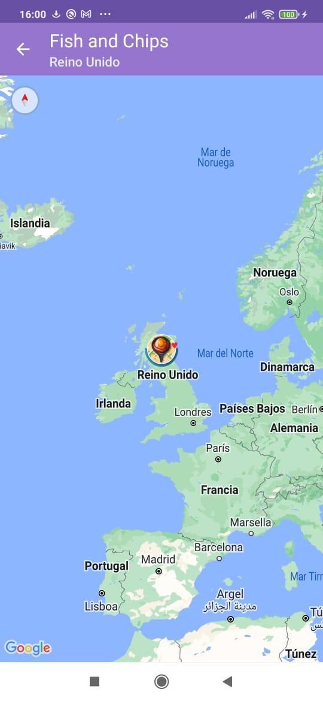
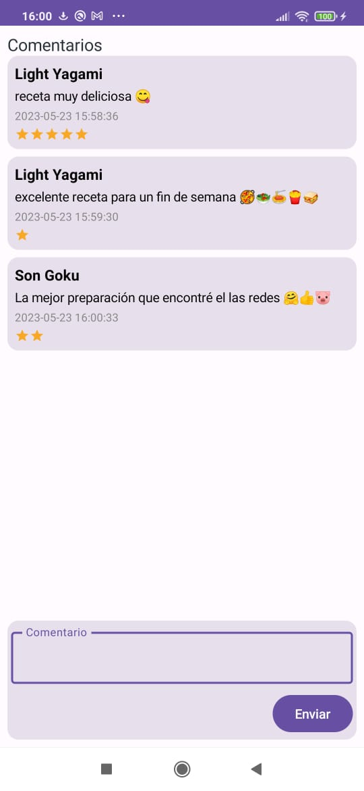
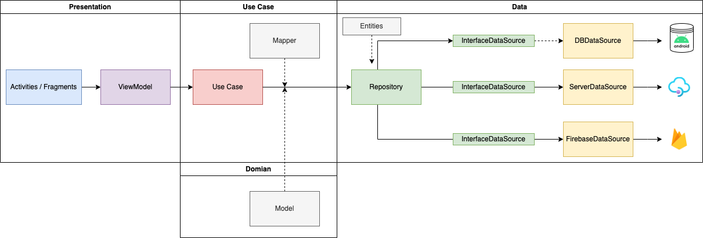

Code Challenge Yape - Mobile Developer - Albert Montes
======================================================

¡Bienvenido(a) al proyecto!

Este proyecto es una pequeña aplicación de recetas de cocina para dispositivos Android, desarrollada en Kotlin. La aplicación te permite visualizar recetas, buscar por nombre o ingredientes, ver los detalles de cada receta y mostrar la ubicación geográfica del origen de la receta en un mapa, ademas poder agregar comentarios de las recetas.

#Características principales
---------------------------
1. Pantalla de búsqueda de recetas: En esta pantalla se muestra una lista de recetas disponibles y un buscador para filtrar las recetas por nombre.
   

2. Pantalla de detalle de receta: Aquí podrás ver la información detallada de una receta específica, incluyendo su imagen, nombre, descripción, preparación e ingredientes. También encontrarás un botón para acceder a la pantalla de mapa y otro boton para acceder a la pantalla de comentarios.
   

3. Pantalla de mapa de geolocalización del origen de la receta: En esta pantalla se muestra un google map con un marcador que indica el origen geográfico de la receta.
   

4. Pantalla de comentarios de usuarios: En esta pantalla se muestra los comentarios que realizaron los usuarios de cada receta.
   

#Arquitectura
-----------------------

El proyecto sigue una Clean Architecture: en 4 capas: Presentation, Use Cases, Domain y Data.

1. Presentation: Se uso un MVVM (Model-View-ViewModel), para garantizar una separación adecuada de responsabilidades y facilitar el mantenimiento del app, asi como mostrar un caso en el que combiban 2 tecnologías en la vista como los clasicos layout con XML y Jeptpack Compose. 
2. Use case: Implementar la lógica de los casos de uso de la aplicación, los use case son atomicos para que solo tengan una responsabilidad.
3. Domain: Incluye las entidades del dominio.
4. Data: Manejar el acceso a los datos y la lógica relacionada con la persistencia y consumo de datos (API, RealTime Database).

   
#Patrone Importantes
---------

1. MVVM para la capa de presentación:En la implementación, se utiliza ViewModel junto con Flow para proporcionar datos observables a la vista, y se emplean coroutines para manejar la asincronía de manera más sencilla. Esto ayuda a separar las responsabilidades y mejorar la mantenibilidad y legibilidad del código.
2. Inyección de dependencias: Se implementó la inyección de dependencias en todos los módulos de la aplicación utilizando Dagger Hilt. El proceso comenzó con la inyección de una interfaz de RemoteService (Retrofit) en el DataSource, ubicado en la capa de datos. A continuación, el DataSource se inyectó en el Repository, y el Repository se inyectó en el UseCase. Finalmente, el UseCase se inyectó en el viewModel, y este último se instanció en el fragmento correspondiente.
3. Repository: Se implementa un patron repository (Repository, Interfaces de data source e implementaciones de las interfaces(API, RealTimeDataBase)), el patrón Repository proporciona una capa de abstracción entre la capa de acceso a datos y la capa de negocio de una aplicación. Ayuda a encapsular la lógica de acceso a datos y a mantener una separación clara entre las diferentes responsabilidades de la aplicación.

#Pruebas Automatizadas:
-----------------------
Se utilizo Mockito y JUnit, ademas de algunas librerias que facilitan las pruebas como:  Coroutines Test y Turbine son útiles cuando se trabaja con coroutines y flows, respectivamente, al facilitar la simulación y prueba de su comportamiento.
1. Pruebas Unitarias:
   - HomeViewModelTest y DetailViewModelTest: se implementaron los test basicamente prueban el comportamiento del viewModel al invocar a UseCase (caso de exito y error).
2. Pruebas de Integración:
   - HomeIntegrationTest: implementa 2 que describo a continuación: 
   Prueba A0: Esta prueba evalúa el estado del ViewModel cuando se carga exitosamente datos desde una fuente de datos remota. El objetivo es validar que el ViewModel maneje correctamente los estados y que la lista de recetas obtenida sea igual a la lista de recetas esperada, es decir se proporciona datos desde la capa Data y se valida que llegaron correctamente hasta las capa de presentación en el ViewModel 
   Prueba A1: El caso es basicamente parecido, pero la respuesta es un error que se obtiene y de igual forma de hace toda la tarza desde la capa de Data hasta presentation. 
   
   En resumen, estas pruebas de integración se centran en evaluar el comportamiento del ViewModel al interactuar con la fuente de datos remota. Se verifican diferentes escenarios, como la carga exitosa de datos y el manejo de errores, asegurándose de que el ViewModel responda adecuadamente a estas situaciones y proporcione el estado correcto a la interfaz de usuario.

#Novedades de la Plataforma:
----------------------------
Considero las siguientes:
1. Jetpack Compose: Se implemento con compose una vista adicional, que muestra los comentarios de la recetas
2. Flow: se implemento porque hay una ventaja en la integración nativa con coroutines, manipulacion de flujo de datos, compatividad con nuevas versiones de las librerias y gestion de errores.
3. RealTime DataBase: Al integrar con flow se muestra de forma muy interezante el proceso de ejecutar tareas asincronas de forma mas facil, el ejemplo de comentarios es muy didactico para mostrar q podemos esperar los estados de un callback o listeners y tratarlos con callbackflow de manera muy facil.
4. Arrow: una biblioteca de programación funcional para Kotlin llamada "arrow-kt:arrow-core". Proporciona una serie de constructos y abstracciones que permiten trabajar con conceptos de programación funcional de manera más concisa y expresiva. Algunas de las características y beneficios de Arrow incluyen: Tipos algebraicos de datos: Arrow ofrece tipos algebraicos de datos como Option, Either, Try y Validated, que permiten manejar casos de ausencia de valor, errores y validaciones de manera más segura y explícita.

